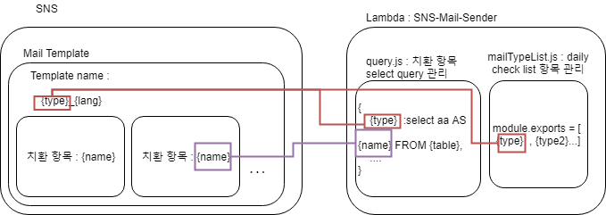

# AWSLambda-SendMailForSES

Using AWS SES and Lambda, you can send mail with only the query selected from MySql.

node version : 8.10.0

## How to add a mailing list
1. Create mail template.
2. Create a template in AWS SES.(naming : {type}_{lang})
3. Add query or dailyMailType  to query.js, mailTypeList.js
- mailTypeList.js : Added the type name used when creating ses template.
- query.js : Create a query with the type name used when creating the ses template. Select the list to be replaced in the template by query.


### Spec
```json
{
    "mode": "{{mode}}",
    "variable": ["column1", "column2"],
    "query": true/false
}
```
mode : The type name used when creating the SES mail.
 - Calling 'dailly_check' with the mode value executes all items in the mailTypeList.js list.
- variable: Variables needed when creating a query.
- query: If false, do not use DB and use variable as templateData. variable must be a json Array. (default: true)

## NPM run Scripts
- daily : Send all daily check items
- test : Send mail with test query

 

